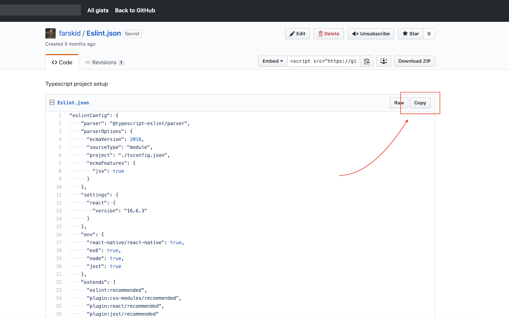
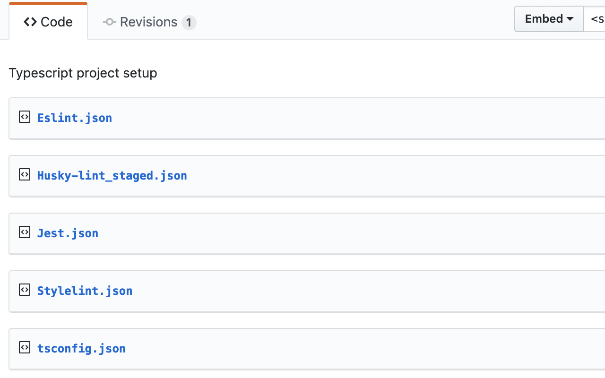

## [👉 Grab it here](https://chrome.google.com/webstore/detail/gist-copy-button/dliomfdofdofnaghhnhnflpolbbaambh)

A chrome extension that adds a set of useful features to Github Gists.

## Featurs

- A copy button added on each file in a Gist

- Convert each file in a Gist into an expandable detail (accordion).
  It won't convert Gist containing only 1 single file

- Settings Page
  You can customize features by setting them on the options pages

## Push an update

- Build project `yarn build`
- Bump versions in manifest.json and package.json (synced versions)
- Make a new package (name and version are automated) `yarn package`
- Upload the new packaged zip to chrome web store
- Make a new git tag based on current version
- Push the new tag

> NOTE: New tags and bumping versions will be automated soon (CI will also automate uploading new packahe to web store)

## Dev

run `yarn dev` to run a watch mode. this mode with build typescript and copy over html, css and manifest file over to distribution folder.

> Note: for now, the dev command only watches src directory
